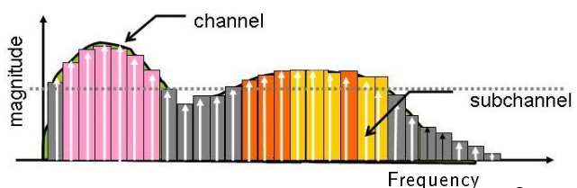
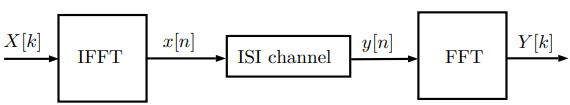
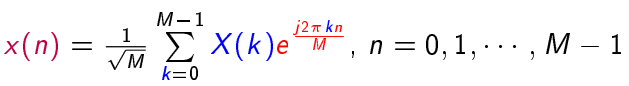
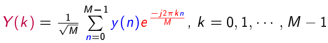
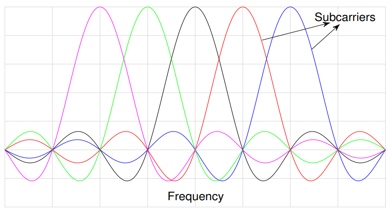
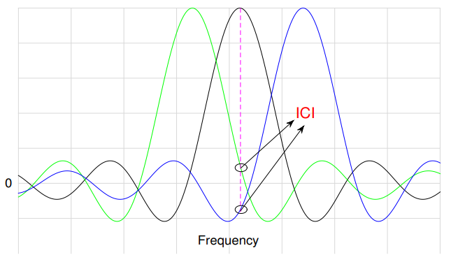
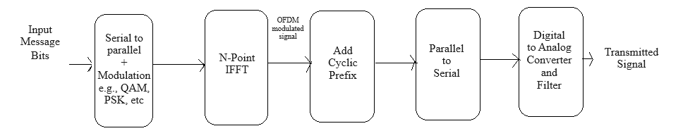
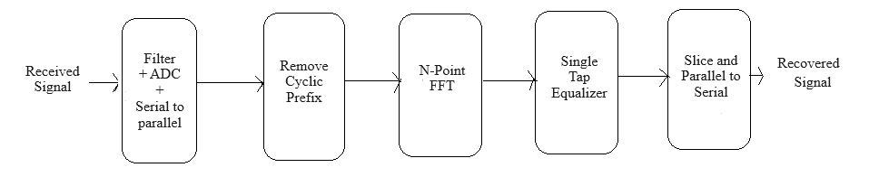

<!DOCTYPE html>
<html lang="en">
<head>
  <meta charset="UTF-8">
  <meta name="viewport" content="width=device-width, initial-scale=1.0">
  <link href="https://cdn.jsdelivr.net/npm/tailwindcss@2.2.19/dist/tailwind.min.css" rel="stylesheet">
</head>
<body>
    <!-- sidebar and body -->
          <h2>
            Orthogonal Frequency Division Multiplexing
          </h2>
          

            When a signal with high bandwidth traverses through a medium, it
            tends to disperse more compared to a signal with lower bandwidth.
             
             
            A high-bandwidth signal comprises a wide range of frequency
            components. Each frequency component may interact differently with
            the transmission medium due to factors such as attenuation,
            dispersion, and distortion. OFDM combats the high-bandwidth
            frequency selective channel by dividing the original signal into
            multiple orthogonal multiplexed narrowband signals. In this way it,
            overcomes the inter-symbol interferences (ISI) issue.
          

          

            
          

          

            OFDM converts frequency-selective channel to multiple (M)
            frequency-flat channels.
          

          <h3>
            Block Diagram:
          </h3>
          

            
             
            
Fig: Orthogonal Frequency Division Multiplexing (OFDM)

          

          

             
            In OFDM, modulation and demodulation are performed using IFFT and
            FFT.
             
          

          

            At transmitter side:  
             
          

          

            
          

          

             
            At receiver side:  
             
          

          

            
          

          

             
            In OFDM, Information is signalled in the frequency domain. It is
            based on 1-D transform in frequency domain (IFFT/FFT). Orthogonality
            among the subcarriers is the key.
          

          

            
          

          <h3>
            Effect of high Doppler in OFDM
          </h3>
          

            In presence of high Doppler, subcarriers lose orthogonality. This
            results in inter-carrier interference (ICI).
          

          

            
          

             
        

        It causes severe degradation in how accurately data is received (known as 'bit error performance') in fast-changing environments (high Doppler), leading to persistent errors (error floors). It also makes it hard to predict and correct for channel distortions ('channel estimation and equalization') in these difficult conditions.
        

        

        To avoid <strong>Inter-Symbol Interference (ISI)</strong> – where parts of one data symbol bleed into the next, causing confusion – when sending many smaller, parallel data signals, each individual signal (called a <strong>subcarrier</strong>) must be kept perfectly separate from the others. This 'perfect separation' is called <strong>orthogonality</strong>. The idea of avoiding ISI by transmitting many such orthogonal, low-bandwidth subcarriers is the core motivation behind OFDM.
        

        

        An OFDM modulator acts like a dispatcher, taking a single, fast stream of data and breaking it down into many slower, parallel streams. Each of these perfectly separated (orthogonal) slower streams then travels through a much simpler part of the radio channel, experiencing very little ISI, and thus can be easily corrected for any remaining distortions.
        

        

        To give an example: imagine a single burst of data lasting 0.25 seconds, so the symbol duration is 
        Tsym = 0.25 s. The corresponding symbol rate is Rsym = 1/Tsym = 4 Hz. 
        Instead of sending all the data on one carrier, OFDM transmits it over multiple <strong>subcarriers</strong>. 
        These subcarriers are placed at frequencies f0, f0+Rsym, 
        f0+2Rsym, f0+3Rsym, and so on. Each subcarrier is 
        orthogonal to the others and carries a portion of the original data in parallel.
        

          <h3>
            OFDM Transmitter
          </h3>
          

            
          

           
          

            1. Data Encoding:Convert the
            input data stream into symbols suitable for transmission (e.g.,
            using QAM, PSK, or other modulation schemes).
             
            2. Serial-to-Parallel Conversion:
            Group the symbols into blocks, and then convert these serially
            arranged symbols into parallel data streams, one for each
            subcarrier.
             
            3. IFFT (Inverse Fast Fourier Transform):
            Apply the IFFT algorithm to convert the time-domain parallel data
            streams into frequency-domain OFDM symbols. The IFFT operation
            converts the data from the frequency domain to the time domain.
             
            4. Cyclic Prefix Addition: Add a
            cyclic prefix to each OFDM symbol to mitigate the effects of
            multipath delay spread. The cyclic prefix is a copy of the end part
            of the OFDM symbol that is appended at its beginning.  
            5. Digital-to-Analog Conversion:
            Convert the time-domain OFDM symbols into analog signals.  
            6. Upconversion and Transmission:
            Upconvert the analog OFDM signal to the desired carrier frequency
            and transmit it over the wireless channel.
          

          <h3>
            OFDM Receiver
          </h3>
          

            
          

           
          

            1. Signal Reception:Receive the
            transmitted OFDM signal after it has traveled through the wireless
            channel.
             
            2. Downconversion:Downconvert the
            received signal to baseband or an intermediate frequency.
             
            3. Analog-to-Digital Conversion:
            : Convert the analog signal into a digital form suitable for
            processing.  
            4. Cyclic Prefix Removal: Remove
            the cyclic prefix from each OFDM symbol.  
            5. FFT (Fast Fourier Transform): 
            Apply the FFT algorithm to convert the time-domain OFDM symbols back
            into the frequency domain. The FFT operation recovers the original
            frequency-domain OFDM symbols. 
            6. Parallel-to-Serial Conversion:
            Convert the frequency-domain symbols back into a serial data stream.
             
            7. Data Demodulation: :
            Demodulate the received symbols to recover the original data stream.
             
            8. Channel Equalization: Apply
            channel equalization techniques to mitigate the effects of channel
            impairments, such as frequency-selective fading.  
            9. Data Decoding:  Decode the
            received symbols to obtain the original transmitted data.  
          

          <!--  -->
</body>
</html>
