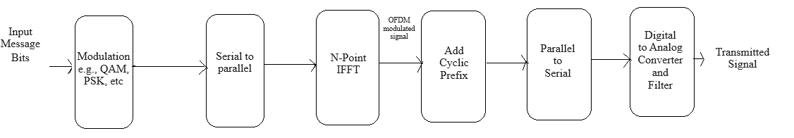
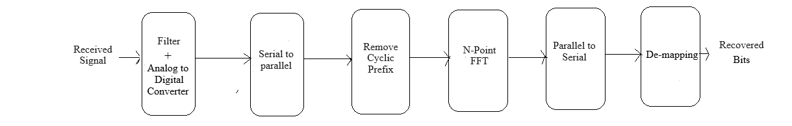

<!DOCTYPE html>
<html lang="en">
<head>
  <meta charset="UTF-8">
  <meta name="viewport" content="width=device-width, initial-scale=1.0">
  <link href="https://cdn.jsdelivr.net/npm/tailwindcss@2.2.19/dist/tailwind.min.css" rel="stylesheet">
    
</head>
<body>
    <!-- sidebar and body -->
<h2>Orthogonal Frequency Division Multiplexing (OFDM)</h2>

OFDM divides a high-bandwidth signal into multiple narrowband subcarriers to reduce <strong>inter-symbol interference (ISI)</strong> and simplify equalization in multipath channels.

<h3>Mathematical Formulation of OFDM</h3>

Let the input data symbols be \(X_k\), for \(k = 0, 1, ..., N-1\), where \(N\) is the number of subcarriers. The OFDM signal in the <strong>time domain</strong> is obtained using the Inverse Fast Fourier Transform (IFFT):

$$
x_n = \frac{1}{\sqrt{N}} \sum_{k=0}^{N-1} X_k \, e^{j 2 \pi k n / N}, \quad n = 0, 1, ..., N-1
$$

Here:
<ul class="list-disc ml-6">
<li>\(X_k\) = frequency-domain symbol on the \(k\)-th subcarrier</li>
<li>\(x_n\) = time-domain OFDM sample</li>
<li>\(N\) = total number of subcarriers</li>
<li>Normalization factor \(1/\sqrt{N}\) ensures constant average power</li>
</ul>

At the receiver, the Fast Fourier Transform (FFT) recovers the transmitted symbols:

$$
Y_k = \frac{1}{\sqrt{N}} \sum_{n=0}^{N-1} y_n \, e^{-j 2 \pi k n / N}, \quad k = 0, 1, ..., N-1
$$

Where:
<ul class="list-disc ml-6">
<li>\(y_n\) = received time-domain OFDM sample</li>
</ul>

<h3>Cyclic Prefix (CP)</h3>

To prevent ISI, a cyclic prefix is added. If \(x_n\) is the original OFDM symbol of length \(N\), the transmitted symbol with CP of length \(N_{CP}\) is:

$$
\tilde{x}_n = 
\begin{cases}
x_{N-N_{CP}+n}, & 0 \le n < N_{CP} \\
x_{n-N_{CP}}, & N_{CP} \le n < N+N_{CP}
\end{cases}
$$

  The sequence x̃ₙ is formed by appending a cyclic prefix of length N_CP to the 
  original signal xₙ. The first N_CP samples of x̃ₙ are copies of the last 
  N_CP samples of xₙ, while the remaining samples correspond to the original 
  signal shifted by N_CP. This results in a new sequence where the end of the 
  signal is repeated at the beginning, a technique commonly used in OFDM systems.

This ensures that linear convolution with the channel becomes circular convolution, preserving orthogonality of subcarriers.

<h3>Subcarrier Spacing and Orthogonality</h3>

  The subcarrier spacing \(\Delta f\) is defined by the sampling frequency \(f_s\) and the number of subcarriers \(N\). It is also the reciprocal of the useful symbol duration \(T_{sym}\):

$$
\Delta f = \frac{f_s}{N} = \frac{1}{T_{sym}}
$$

  This specific spacing guarantees that the subcarriers are <strong>orthogonal</strong> (mutually independent):

$$
\sum_{n=0}^{N-1} e^{j 2 \pi (k-m) n / N} = 
\begin{cases}
N, & k=m \\
0, & k \ne m
\end{cases}
$$

  Where \(k\) and \(m\) are subcarrier indices. <strong>Orthogonality</strong> ensures no inter-carrier interference (ICI) in ideal conditions.

          <h3>
            OFDM Transmitter
          </h3>
          

            
             
            <strong>Fig 1: OFDM Transmitter Block Diagram</strong>
          

           
          

            1. Modulation:
            The input message bits are mapped into complex symbols using digital 
            modulation schemes such as Quadrature Amplitude Modulation (QAM) or 
            Phase Shift Keying (PSK).
             
            2. Serial-to-Parallel Conversion:
            The modulated symbols are grouped into blocks and converted from a 
            serial stream into parallel streams, each corresponding to a subcarrier.
             
            3. IFFT (Inverse Fast Fourier Transform):
            An N-point IFFT is applied to the parallel data to convert the 
            frequency-domain symbols into a time-domain OFDM signal while maintaining 
            orthogonality among subcarriers.
             
            4. Cyclic Prefix Addition:
            A cyclic prefix is added to each OFDM symbol to reduce inter-symbol 
            interference caused by multipath propagation. It is formed by copying 
            the last portion of the symbol and appending it to the beginning.
             
            5. Parallel-to-Serial Conversion:
            The parallel OFDM symbols are converted back into a serial stream to 
            produce a continuous signal.
             
            6. Digital-to-Analog Conversion and Filtering:
            The discrete-time OFDM signal is converted into a continuous-time analog 
            signal using a digital-to-analog converter (DAC). A reconstruction filter 
            is then applied to smooth the signal and remove unwanted spectral components.
             
            7. Transmission:
            The resulting analog signal is transmitted over the communication channel.
          

          <h3>
            OFDM Receiver
          </h3>
          

            
                         
            <strong>Fig 2: OFDM Receiver Block Diagram</strong>
          

           
          

            1. Signal Reception:
            Receive the incoming OFDM signal from the channel.
             
            2. Filtering & Analog-to-Digital Conversion:
            Filter the received signal and convert it from analog to digital form for further processing.
             
            3. Serial-to-Parallel Conversion:
            Convert the incoming serial data stream into parallel data blocks corresponding to OFDM symbols.
             
            4. Cyclic Prefix Removal:
            Remove the cyclic prefix from each OFDM symbol to eliminate redundancy added during transmission.
             
            5. N-Point FFT:
            Apply the FFT to transform the time-domain signal into the frequency domain and recover subcarrier data.
             
            6. Parallel-to-Serial Conversion:
            Convert the parallel frequency-domain data back into a serial stream.
             
            7. De-mapping:
            Map the received symbols back to their corresponding bit sequences to recover the transmitted bits.
          

</body>
</html>
